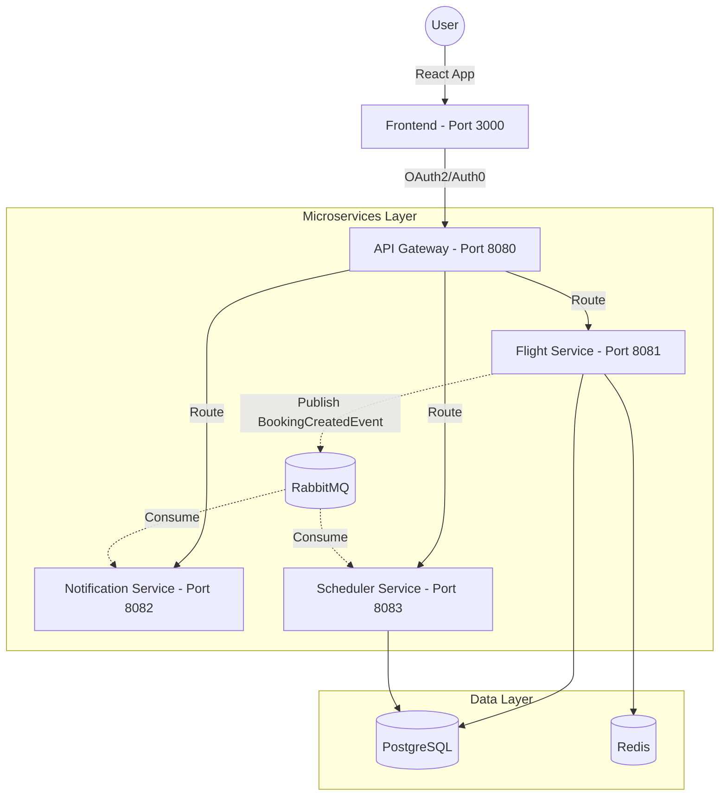

# ✈️ Airline Ticketing System (Microservices)
Demo Link: https://youtu.be/Cs9eY__gWQY


A modern, cloud-native airline reservation system built with a robust microservices architecture. This project demonstrates high-scale patterns for flight search, multi-passenger booking, and real-time notifications.

---

## 🏗️ System Architecture

The system follows an **Event-Driven Architecture (EDA)** pattern for asynchronous communication and **API Gateway** pattern for unified entry points.



### Core Components:
- **API Gateway**: Handles CORS, rate limiting, and centralized routing.
- **Flight Service**: Manages flight schedules, complex pricing logic, and multi-passenger bookings.
- **Notification Service**: Listens for RabbitMQ events to trigger real-time emails.
- **Scheduler Service**: Handles batch jobs for flight status updates and loyalty program (Miles&Smiles) calculations.

---

## 🚀 Key Features

- **Auth0 Integration**: Secure, identity-driven authentication with seamless tenant migration capabilities.
- **Multi-Passenger Support**: Dynamic form generation and validation for group bookings.
- **Intelligent Pricing**: Real-time total price calculation based on passenger counts and flight availability.
- **Event-Driven Emails**: Asynchronous confirmation emails with detailed passenger summaries.
- **Miles&Smiles Loyalty**: Integrated points system with Tier management (Bronze, Silver, Gold, Platinum).
- **Resilient Search**: Accelerated flight search using Redis caching.

---

## 🛠️ Technology Stack

| Category | Technologies |
|:--- |:--- |
| **Backend** | Java 17, Spring Boot 3.2.5, Spring Cloud Gateway |
| **Frontend** | React 18, Vite, CSS (Modern Glassmorphism) |
| **Persistence** | PostgreSQL 15, Flyway (Migration Control) |
| **Messaging** | RabbitMQ (Asynchronous Event Bus) |
| **Security** | Auth0, JWT, OAuth2, API Key (Partner Auth) |
| **Caching** | Redis (Search optimization & Rate limiting) |
| **DevOps** | Docker, Docker Compose, Maven Multi-module |

---

## 🧠 Implementation Challenges

> [!NOTE]
> **Identity Provider Migration**: One of the critical phases was the seamless migration from Azure AD B2C to Auth0. This involved refactoring our `MilesAccount` domains and updating security configurations without disrupting service availability.
> 
> **Multi-Passenger Grid Layout**: Implementing a truly responsive booking form that handles dynamic passenger inputs while maintaining layout integrity was solved using CSS Grid `auto-fit` and `minmax` patterns.
> 
> **Distributed Transactions**: Ensuring data consistency between `Flight Service` and `Scheduler Service` during booking creation was achieved via RabbitMQ's reliable messaging.

---

## 🚦 Quick Start

### 1. Infrastructure Setup
```bash
# Spin up DB, RabbitMQ and Redis
docker-compose up -d postgres rabbitmq redis
```

### 2. Backend Build
```bash
# From root directory
mvn clean package -DskipTests
```

### 3. Running Services
```bash
# Start microservices (separate terminals or background)
cd flight-service && mvn spring-boot:run
cd api-gateway && mvn spring-boot:run
cd scheduler-service && mvn spring-boot:run
```

### 4. Frontend Start
```bash
cd frontend && npm install && npm run dev
```

---

## 🔌 API Showcase

### Booking Creation (Multi-Passenger)
```bash
POST /api/v1/bookings
Content-Type: application/json
Authorization: Bearer <auth0-jwt>

{
  "flightId": 42,
  "passengers": [
    { "firstName": "John", "lastName": "Doe", "passportNo": "P123" },
    { "firstName": "Jane", "lastName": "Doe", "passportNo": "P124" }
  ],
  "paymentMethod": "CREDIT_CARD"
}
```

---

## 📈 Demo & Verification
You can use the built-in test scripts for direct verification:
- `test-scripts/test-auth.ps1`: Validates the Auth0 handshake.
- `test-email-direct.ps1`: Verifies the SMTP/Email relay status.

---


